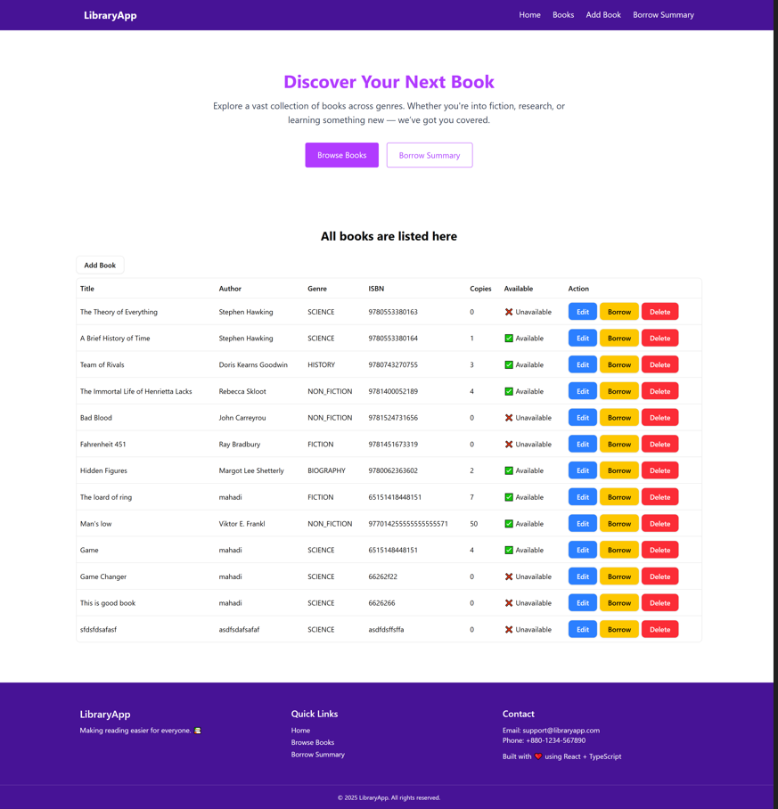

# 📚 Minimal Library Management System

A full-stack Library Management System where users can manage books, update availability, and borrow books. Built with React, Redux Toolkit, TypeScript, and Tailwind CSS on the frontend, and Node.js, Express.js, and MongoDB on the backend.

---

## 🚀 Features

- 🔍 View detailed information of each book
- 📘 Add, update, and delete books
- 🧾 Borrow books with quantity and due date
- ✅ Real-time availability tracking
- 🧠 Clean and reusable component structure
- 🧰 Built using modern tools (RTK Query, Tailwind, TypeScript)

---

## 🧑‍💻 Tech Stack

### Frontend:

- **React** with **TypeScript**
- **Redux Toolkit & RTK Query**
- **Tailwind CSS**
- **React Hook Form** for form handling
- **React Router DOM**

### Backend:

- **Node.js** + **Express.js**
- **MongoDB** with **Mongoose**

---

## 🛠️ Installation

### 1. Clone the Repo

```bash
git clone https://github.com/mahadi61/library-management-system.git
cd library-management-system
```

2. Install Frontend Dependencies

```
npm install
```

3. Run project

```
npm run dev
```


